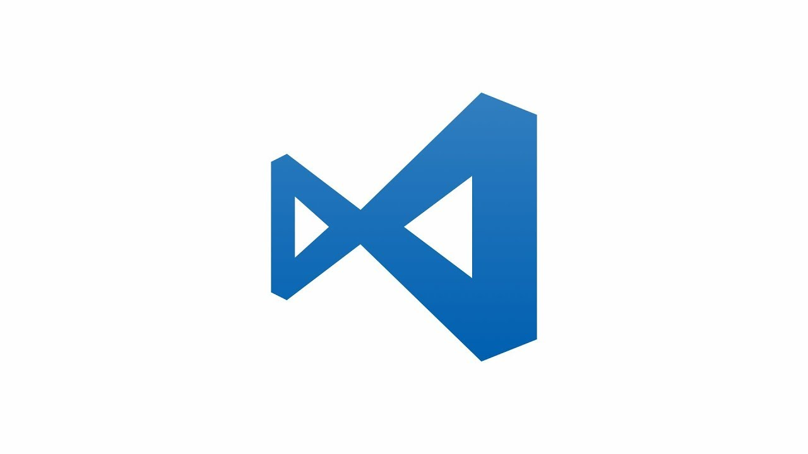
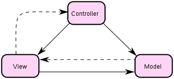
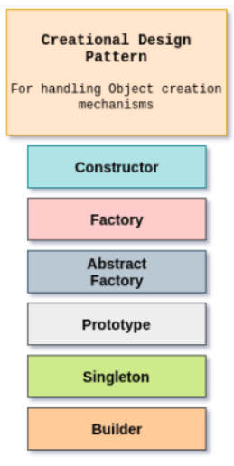
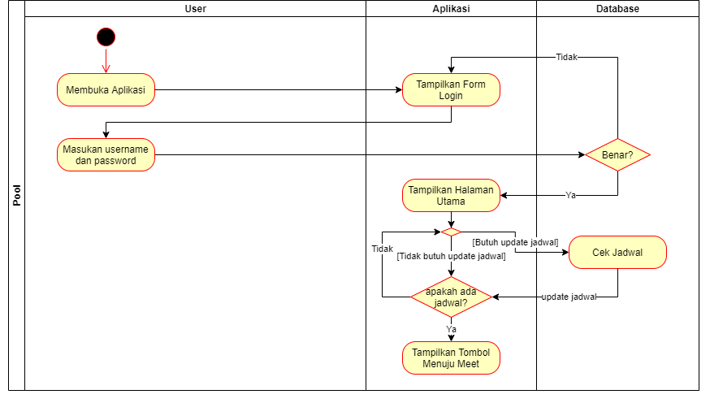
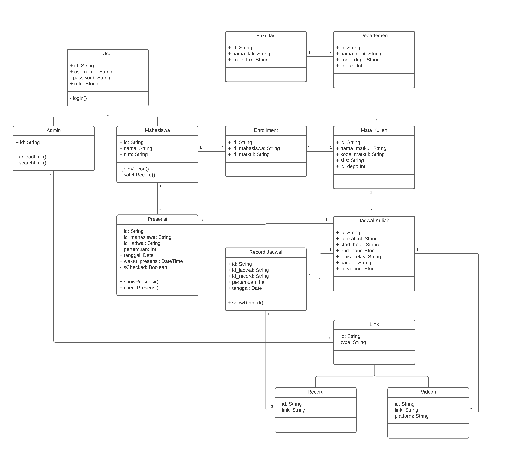
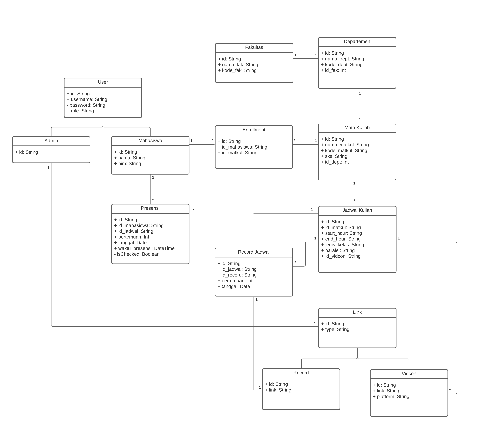
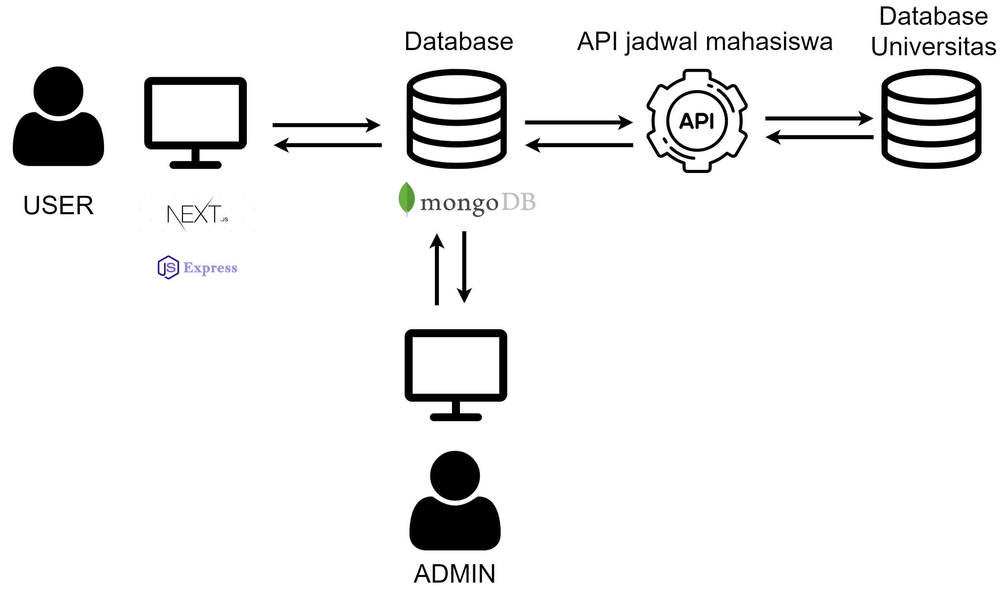
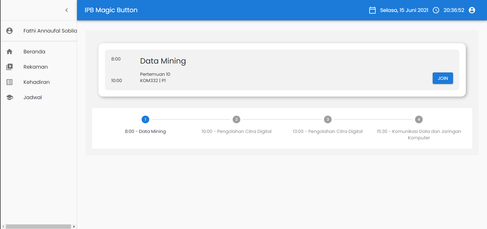
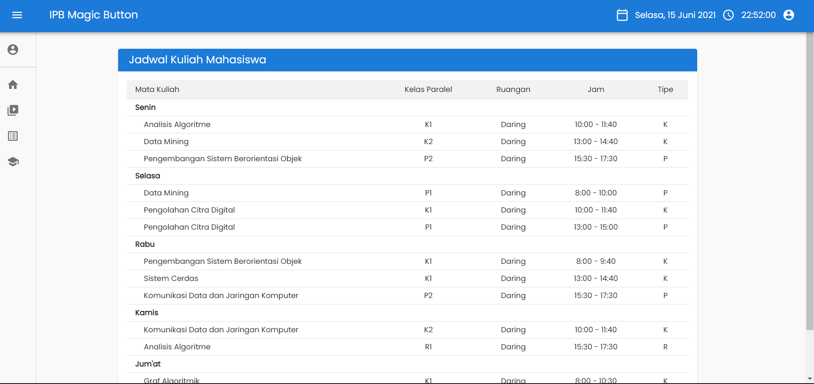

<h1 align="center">Magic Button (Kelompok 9 P2)</h1>

<p align="center">Magic Button merupakan sebuah platform berbasis website untuk mempermudah mahasiswa untuk bergabung kedalam video conference. Platform ini dibangun dengan stack teknologi MERN (MongoDB, Express.js, React, dan Node.js)</p>

<div align="center">
    
    
    
    
</div>

| [Deskripsi Singkat](#deskripsi-singkat) | [User Analysis](#user-analysis) | [Lingkungan Pengembangan](#lingkungan-pengembangan) | [Konsep OOP](#konsep-oop) | [Tipe Desain Pengembangan](#tipe-desain-pengembangan) | [Hasil dan Pembahasan](#hasil-dan-pembahasan) | [Hasil Implementasi](#hasil-implementasi) | [Developer dan Jobdesc](#developer-dan-jobdesc) | [Saran](#saran) | [Link Pendukung](#link-pendukung) |
| :-------------------------------------: | :-----------------------------: | :-------------------------------------------------: | :-----------------------: | :---------------------------------------------------: | :-------------------------------------------: | :---------------------------------------: | :---------------------------------------------: | --------------- | --------------------------------- |

## Deskripsi Singkat

[`^ kembali ke atas ^`](#)

Magic Button merupakan fitur untuk mempermudah mahasiswa untuk masuk kedalam video conference. Mahasiswa tidak perlu pusing untuk mencari link video conference yang ada di masing- masing grup kuliah atau praktikum dimana sering sekali tertimbun chat. Fitur ini menyesuaikan jadwal tiap mahasiswa dan dosen, sehingga apabila sudah waktunya kelas, mahasiswa dan dosen hanya perlu menekan satu tombol di halaman utama dan mereka akan langsung masuk ke dalam kelas online yang sudah disediakan oleh sistem. Tombol tersebut akan membawa pengguna ke dalam link video conference yang benar sesuai jadwal mereka saat itu. Fitur selanjutnya yaitu fitur history video conference yang sudah pernah dihadiri beserta link rekaman dari video conference tersebut sesuai dengan jadwal tiap mahasiswa. Terdapat pula fitur tambahan lain seperti notifikasi pengingat yang muncul setiap kelas virtual akan dimulai dan fitur presensi otomatis setiap mahasiswa mengklik tombol “Magic Button”.

## User Analysis

[`^ kembali ke atas ^`](#)

### User Story

- Saya sebagai mahasiswa, saya ingin bergabung dengan kelas virtual tanpa ribet sehingga saya dapat fokus memperhatikan materi kuliah.
- Saya sebagai mahasiswa, saya ingin melihat kembali rekaman ulang mata kuliah secara lebih mudah dan lengkap.
- Saya sebagai mahasiswa, saya ingin mendapat notifikasi pengingat setiap kelas virtual akan dimulai sehingga saya tidak melewatkan kelas karena lupa.
- Saya sebagai mahasiswa, saya ingin presensi dilakukan otomatis setiap menghadiri kelas virtual sehingga saya tidak melewatkan presensi karena lupa.

## Ruang Lingkup

Aplikasi ini hanya digunakan oleh mahasiswa, dosen, dan pengurus. Digunakan untuk
keperluan perkuliahan secara synchronous.

## Lingkungan Pengembangan

[`^ kembali ke atas ^`](#)

**Software**

```
- Visual Studio Code
- Postman
```


  
**Hardware**

```
- processor : Intel core i5-8300
- RAM : 8GB
- VGA : NVIDIA GTX 1050
```

**Tech Stack**

```
- Next.js (Front-end)
- Express.js (Back-end)
- MongoDB (DBMS)
```

---

## Konsep OOP

[`^ kembali ke atas ^`](#)

**Abstraction**

Abstraction adalah prinsip yang menyembunyikan detail implementasi fungsi ataupun prototype, sehingga saat pemanggilan fungsi, pengembang tidak perlu tahu cara kerja fungsi tersebut secara detail. Penerapan konsep abstraction pada aplikasi ini adalah pada fungsi middleware verifyRole(), pengembang hanya tinggal memasukkan role yg ingin diverifikasi pada parameter untuk memverifikasi apakah role tersebut sesuai dengan token auth user.

**Inheritance**

Inheritance adalah konsep OOP dimana kita dapat membentuk class baru yang “mewarisi” atau memiliki bagian-bagian dari class yang sudah ada sebelumnya. Konsep ini menggunakan sistem hirarki atau bertingkat. Pada aplikasi ini contohnya adalah kelas Link yang memiliki child class Vidcon & Record.

**Polymorphism**

Polymorphism adalah konsep dimana suatu objek yang berbeda-beda dapat diakses melalui interface yang sama. Sebuah objek yang polymorphic dapat beradaptasi dengan metode apapun yang diimplementasikan pada objek tersebut, dan setiap class memiliki interpretasinya tersendiri terhadap interfacenya. Pada aplikasi ini contohnya adalah kelas Vidcon yang memiliki method create Link yang diwariskan dari parent class Link tetapi dengan cara yang berbeda dari kelas Record.

## Tipe Desain Pengembangan

[`^ kembali ke atas ^`](#)

### Architectural Pattern

**MVC**

Dalam mengembangkan aplikasi ini, kelompok kami menggunakan pattern MVC (Model View Controller) yang dimana sistem pengembangan aplikasi tersebut akan dipecah menjadi tiga bagian, yaitu model (database), view (tampilan/ui) dan yang terakhir controller (interaksi model dan view). Model digunakan untuk menginterpretasikan entitas dan atributnya ke dalam database. Controller digunakan sebagai metode dari model untuk memproses data, seperti menyimpan ke dalam database ataupun melakukan fetch terhadap API IPB. View digunakan untuk menampilkan data yang diperlukan



### Design Pattern

**Factory Pattern**



Pattern ini adalah salah satu creational design pattern yang menyediakan interface pembuatan objek pada superclass, tetapi juga membolehkan subclass untuk mengubah tipe pembuatan objek tersebut.

## Hasil dan Pembahasan

[`^ kembali ke atas ^`](#)

### Use Case Diagram


### Activity Diagram



### Class Diagram



### Entity Relationship Diagram



### Arsitektur Sistem



### Fungsi Utama yang Dikembangkan

fungsi utama yang kita kembangkan adalah tombol join
untuk masuk kedalam video conference sesuai dengan jadwal
yang dimiliki oleh mahasiswa atau dosen.

### Fungsi CRUD

- CRUD Admin

1. Menambah Link
   admin dapat menambahkan link video converence yang akan digunakan mahasiswa
2. Otomatis Presensi
   tombol join otomatis kana menginput daftar hadir mahasiswa kedalam database

## Hasil Implementasi

[`^ kembali ke atas ^`](#)

### Screenshot Sistem

Halaman Utama


Halaman Jadwal Mahasiswa


### Link Aplikasi

Front-end : http://frontend-magic-button.vercel.app/

Back-end : https://psbo-magic-button.herokuapp.com/

## Saran

[`^ kembali ke atas ^`](#)

Sistem yang kami gunakan belum mendapat rincian tentang informasi
pertemuan keberapa yang dihadiri oleh mahasiswa. Diharapkan untuk
pengembangan lebih lanjut terdapat detail spesifik tentang pertemuan
yang sedang dihadiri oleh mahasiswa

## Developer dan Jobdesc

[`^ kembali ke atas ^`](#)
| Nama | NIM | Role |
| --------------------- | --------- | --------- |
| Indra Rizky Gunawan | G64180010 | UI/UX |
| M. Dwiki Ramdhani | G64180032 | Front-end |
| Ihsan Firdaus | G64180054 | Front-end |
| Sultan Fariz | G64180086 | Back-end |
| Fathi Annaufal Soblia | G64180094 | Back-end |

## Link Pendukung

[`^ kembali ke atas ^`](#)

### Figma

https://ipb.link/figma-psbo-kel-9

### Repo Back-end

https://github.com/sultanfariz/backend-magic-button

### API Docs

https://documenter.getpostman.com/view/14458184/TzXwEJLU
